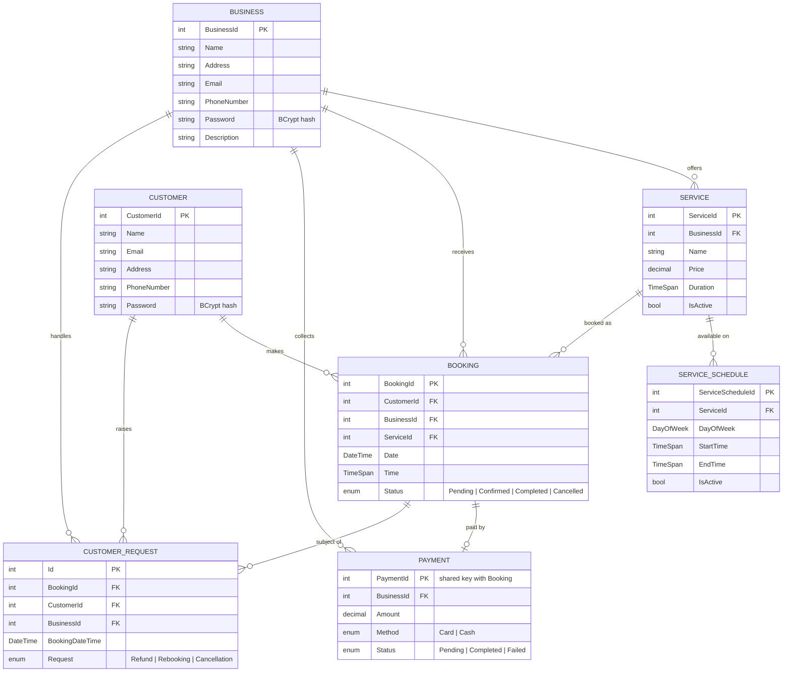
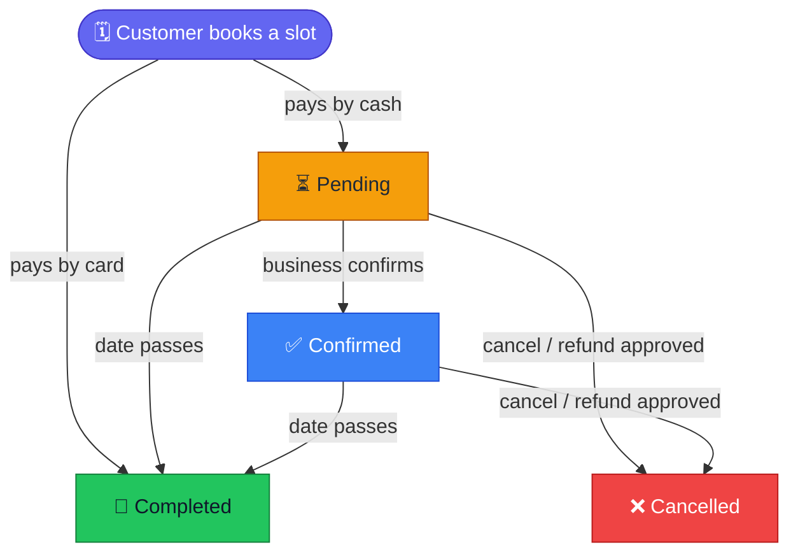
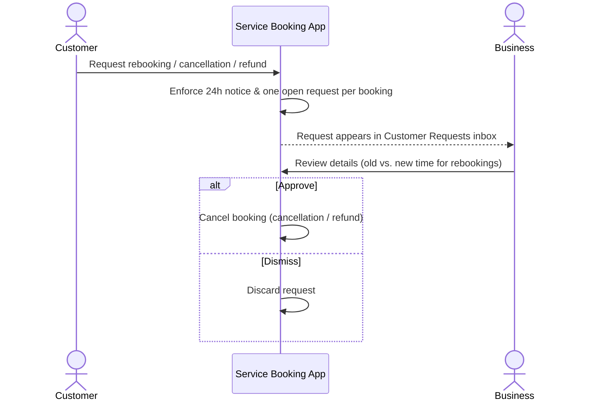

<div align="center">

# 🗓️ Service Booking App

**A two-sided desktop booking platform for local service businesses and their customers.**

Businesses publish services and weekly schedules, customers book real available time slots and pay by card or cash,
and every change request flows back to the business through a single dashboard.


[Features](#-features) •
[Tech Stack](#-tech-stack) •
[Architecture](#-architecture) •
[Getting Started](#-getting-started) •
[How It Works](#-how-it-works)

</div>

---

## ✨ Features

### 🏢 Business Portal

| | Feature | Description |
|---|---|---|
| 📊 | **Analytics dashboard** | Total bookings and revenue at a glance, a pie chart of bookings per service and a monthly revenue column chart (LiveCharts). |
| 🛠️ | **Service management** | Create, edit and price services with a duration and description; toggle services active/inactive without deleting history. |
| 🕒 | **Weekly schedules** | Define opening hours per service, per day of the week, with start/end validation and per-day enable/disable. |
| 📋 | **Booking management** | Filter, reschedule, re-status and refund bookings, with clash detection on edits and past bookings auto-marked *Completed*. |
| 📨 | **Customer requests inbox** | Review cancellation, refund and rebooking requests (old vs. proposed time shown side by side), then approve or dismiss. |
| 👤 | **Business profile** | Editable name, address, contact details and a public description shown to customers. |

### 🙋 Customer Portal

| | Feature | Description |
|---|---|---|
| 🔎 | **Browse businesses** | Discover businesses and view each one's profile and active services. |
| 📅 | **Live slot picker** | Only genuinely free time slots are offered, generated from the service schedule and length. |
| 💳 | **Card or cash checkout** | Card payments are validated and settle the booking immediately; cash bookings stay *Pending* until paid in person. |
| 🔁 | **Rebook & cancel requests** | Ask the business to move (24h+ notice) or cancel/refund a booking, with one open request per booking. |
| 🧾 | **My bookings** | All bookings filterable by status, plus an editable profile. |

### 🔐 Across the App

- **Secure authentication**: passwords hashed with **BCrypt**; separate sign-up/login flows for businesses and customers.
- **Persistent sessions**: users stay logged in between launches, and protected pages redirect when accessed without a session.
- **Input validation**: email, phone, time-format and required-field checks with clear feedback dialogs.
- **Polished UI**: Material Design theme, custom Noto Sans and Roboto typography, and friendly empty-state placeholders.

---

## 🧰 Tech Stack

| Layer | Technology |
|---|---|
| **Language** | C# |
| **UI framework** | WPF (XAML) on .NET Framework 4.7.2 |
| **Styling** | MaterialDesignThemes 5.3 + MaterialDesignColors |
| **Charts** | LiveCharts.Wpf 0.9.7 |
| **ORM** | Entity Framework 6.5 (code-first, migrations) |
| **Database** | SQL Server LocalDB (`MSSQLLocalDB`) |
| **Security** | BCrypt.Net-Next 4.1 |
| **Tooling** | Visual Studio, NuGet, EF Package Manager Console |

---

## 🏗️ Architecture

The solution contains two projects:

```
ServiceBookingApp.sln
│
├── ServiceBookingApp/                  # WPF desktop application
│   ├── Data/
│   │   └── ServiceBookingContext.cs    # EF6 DbContext + fluent relationship config
│   ├── Helper/
│   │   └── SessionManager.cs           # Login state + persisted session
│   ├── Migrations/                     # Code-first schema history + seed
│   ├── Models/                         # Business, Customer, Service, ServiceSchedule,
│   │                                   # Booking, Payment, CustomerRequest
│   ├── Resources/                      # Noto Sans & Roboto fonts
│   └── Views/
│       ├── HomePage.xaml               # "Log in as a Business / Customer"
│       ├── Business/
│       │   ├── Auth/                   # BusinessLogin, BusinessSignup
│       │   └── Dashboard/              # Dashboard, Services, Schedules, Bookings,
│       │                               # Customer Requests, Edit Profile
│       └── Customer/
│           ├── Auth/                   # CustomerLogin, CustomerSignup
│           ├── Booking Flow/           # Browse → Business Profile → Confirm & Pay
│           └── Dashboard/              # Dashboard, My Bookings, Edit Profile
│
└── DataManagement/                     # Console tool that seeds realistic demo data
    └── Program.cs
```

### 🗃️ Data Model



Relationships are configured with the EF6 fluent API: deleting a service cascades to its schedules,
while bookings, payments and requests use restricted deletes so booking history is never lost by accident.

---

## 🚀 Getting Started

### Prerequisites

- **Windows** (WPF is Windows-only)
- **Visual Studio 2019 or 2022** with the *.NET desktop development* workload
- **SQL Server Express LocalDB** (installed with Visual Studio by default)

### Installation

1. **Clone the repository**

   ```bash
   git clone https://github.com/wxvz/ServiceBookingApp.git
   ```

2. **Open the solution:** open `ServiceBookingApp.sln` in Visual Studio. NuGet packages restore automatically on first build.

3. **Create the database:** open **Tools → NuGet Package Manager → Package Manager Console**, set *Default project* to `ServiceBookingApp`, then run:

   ```powershell
   Update-Database
   ```

   This applies every migration to a LocalDB database named `ServiceBookingData`.

4. **(Optional) Load demo data:** right-click the **DataManagement** project → *Set as Startup Project* → run it (<kbd>Ctrl</kbd>+<kbd>F5</kbd>).
   It creates 5 businesses, 8 customers, their services and weekly schedules, and 80 bookings spread from three months ago to one month ahead, so the dashboard charts have data to show.

5. **Run the app:** set **ServiceBookingApp** as the startup project and press <kbd>F5</kbd>.

### 🔑 Demo Accounts

After seeding, every demo account uses the password **`1234`**.

| Role | Name | Email |
|---|---|---|
| Business | Dublin Auto Repair | `contact@dublinauto.ie` |
| Business | Galway Barbers | `info@galwaybarbers.ie` |
| Customer | John Doe | `john.d@example.com` |
| Customer | Jane Smith | `jane.s@example.com` |

---

## ⚙️ How It Works

### Booking lifecycle



### Smart slot generation

When a customer picks a date, the app:

1. Looks up the service's **active schedule** for that day of the week (no schedule means no slots, and the *Book* button is disabled).
2. Walks from the schedule's start time to its end time in steps of the **service duration**. For same-day bookings it starts at the next half-hour.
3. Filters out any slot that overlaps an existing **Pending** or **Confirmed** booking.
4. Runs a **final conflict check at checkout**, so if someone else took the slot in the meantime the customer is told and the slot list refreshes.

### Customer request workflow



---

## 🗺️ Roadmap

- [ ] Automatically move the booking when a rebooking request is approved
- [ ] Email notifications for new bookings and request outcomes
- [ ] Integration with a real payment provider
- [ ] Move page logic into view models (MVVM) and add a unit test project
- [ ] Customer reviews and ratings on business profiles

---

## 👤 Author

**Frank Aka**, [@wxvz](https://github.com/wxvz)

<div align="center">

⭐ If you found this project interesting, consider giving it a star!

</div>
